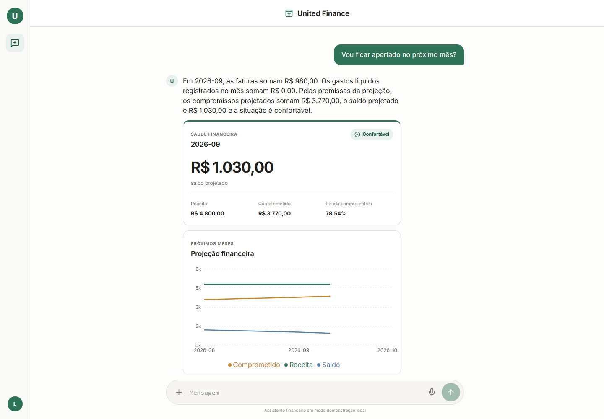
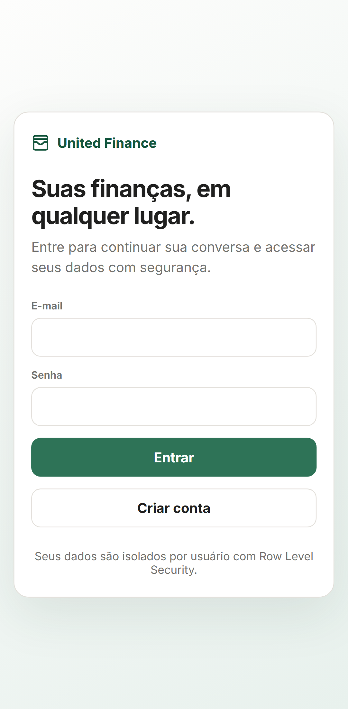
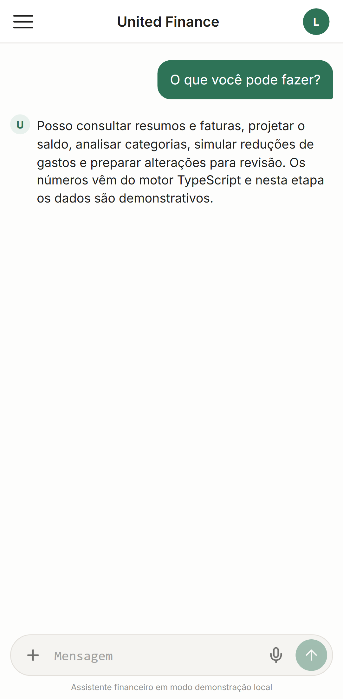
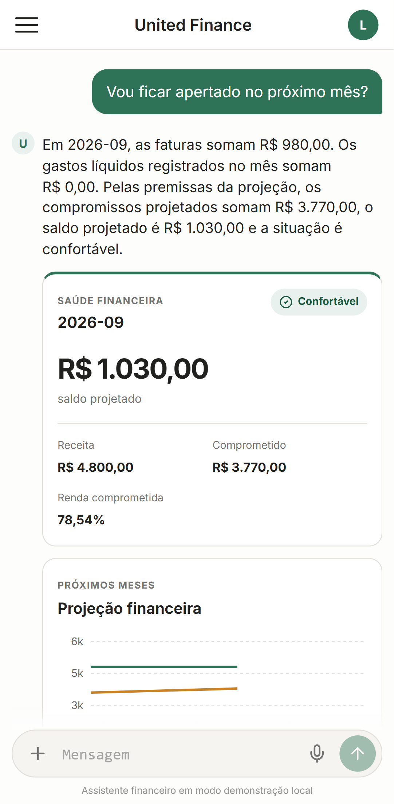
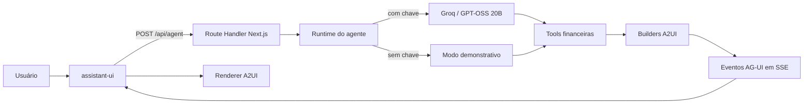

# United Personal Finance

Assistente pessoal de finanças, orientado por conversa, para registrar movimentações em português, consultar faturas e analisar a evolução financeira com resultados determinísticos.

[](https://github.com/jonathabot/united-personal-finance/actions/workflows/ci.yml)

O projeto combina um agente de linguagem com uma interface generativa. A IA interpreta o pedido e escolhe ferramentas; valores, parcelas, totais e projeções são calculados por código TypeScript testável.

## Estado atual

A **POC 1.0 local está concluída**. O fluxo conversacional, o motor financeiro,
as tools, a persistência no Supabase e o catálogo visual estão integrados e
validados localmente. Publicação, instalação como PWA e observabilidade ficam
para a etapa pós-POC.

## Capturas da interface

### Desktop



### Mobile

| Tela de login | Conversa textual | Projeção financeira |
| :---: | :---: | :---: |
|  |  |  |

## Arquitetura atual



### Responsabilidades

| Camada | Responsabilidade |
| --- | --- |
| Agente | Interpretar linguagem, identificar intenção e selecionar tools. |
| Tools | Expor operações financeiras autorizadas e validadas. |
| Motor financeiro | Calcular centavos, parcelas, faturas, saldos e projeções. |
| AG-UI | Transportar ciclo de execução, texto e eventos visuais. |
| A2UI | Descrever tabelas, cards e gráficos como dados validados. |
| Renderer React | Validar o payload e renderizar somente componentes permitidos. |
| Banco de dados | Armazenar dados financeiros temporais, conversas e histórico auditável com RLS. |

## Princípios do projeto

1. A IA interpreta; o código calcula.
2. Dinheiro é armazenado em centavos inteiros.
3. Respostas do modelo passam por validação antes de serem utilizadas.
4. O agente não gera HTML, JSX ou CSS arbitrário.
5. Uma transação não deve ser persistida sem validação e confirmação.
6. Operações ambíguas devem pedir esclarecimento.
7. Edições e exclusões deverão ser auditáveis e reversíveis.

## Tecnologias

| Tecnologia | Uso |
| --- | --- |
| Next.js 16 | Aplicação web full-stack e rota do agente. |
| React 19 | Interface, chat e catálogo de componentes. |
| assistant-ui | Runtime, primitives de conversa, composer e ciclo visual das mensagens. |
| `@assistant-ui/react-ag-ui` | Adaptador oficial entre assistant-ui e o backend AG-UI. |
| `@ag-ui/client` | Cliente `HttpAgent` para consumir o stream SSE. |
| TypeScript | Domínio financeiro e contratos tipados. |
| Zod | Validação de requests e payloads A2UI. |
| `@ag-ui/core` | Tipos e eventos do protocolo AG-UI. |
| Groq SDK | Acesso ao modelo hospedado na Groq. |
| GPT-OSS 20B | Interpretação de linguagem e seleção de tools. |
| Lucide React | Ícones da interface baseada no Pencil. |
| Recharts | Gráficos financeiros responsivos renderizados no navegador. |
| Supabase JS + SSR | Autenticação por cookies e acesso ao Postgres respeitando RLS. |
| Vitest | Testes unitários do domínio. |
| Playwright | Testes E2E e geração das capturas desktop e mobile. |
| ESLint | Análise estática do código. |

### Planejado

- Vercel para deploy da aplicação.
- PWA para instalação no celular.

## Estrutura principal

```text
src/
├─ app/
│  ├─ api/agent/route.ts       # Stream de eventos do agente
│  ├─ auth/callback/route.ts   # Troca do código de autenticação por sessão
│  ├─ login/                   # Tela e ações de autenticação
│  ├─ globals.css              # Layout responsivo baseado no Pencil
│  └─ page.tsx                 # Shell da aplicação
├─ components/
│  ├─ a2ui/
│  │  ├─ catalog.ts            # Catálogo fechado de componentes permitidos
│  │  ├─ renderer.tsx          # Renderer declarativo
│  │  ├─ financial-health-card.tsx
│  │  ├─ projection-chart.tsx
│  │  ├─ category-breakdown.tsx
│  │  ├─ savings-opportunity-table.tsx
│  │  ├─ scenario-comparison.tsx
│  │  └─ feedback-card.tsx     # Esclarecimento e erro
│  └─ chat/finance-chat.tsx    # Thread, composer e runtime assistant-ui
└─ lib/
   ├─ a2ui/
   │  ├─ builders.ts           # Payloads financeiros confiáveis
   │  └─ schema.ts             # Contratos Zod
   ├─ agent/runtime.ts         # Groq, tools e fallback demonstrativo
   ├─ data/
   │  └─ demo-financial-data.ts # Fonte temporária usada para testar o chat
   ├─ finance/
   │  ├─ statements.ts        # Fechamento, vencimento e total das faturas
   │  ├─ installments.ts      # Cronograma e parcelas futuras
   │  ├─ monthly-summary.ts   # Visão consolidada do mês
   │  ├─ projections.ts       # Saldo projetado e saúde financeira
   │  ├─ categories.ts        # Comparação e oportunidades por categoria
   │  ├─ scenarios.ts         # Simulações sem persistência
   │  └─ finance.test.ts      # Casos determinísticos do motor
   ├─ tools/
   │  ├─ definitions.ts       # Contratos apresentados ao modelo
   │  ├─ schemas.ts           # Validação Zod dos argumentos
   │  ├─ executor.ts          # Ponte segura para o motor financeiro
   │  └─ executor.test.ts     # Testes de integração das tools
   ├─ supabase/
   │  ├─ client.ts            # Cliente do navegador
   │  ├─ server.ts            # Cliente SSR baseado em cookies
   │  └─ config.ts            # Configuração pública validada
   ├─ repositories/
   │  ├─ financial-repository.ts          # Contrato independente da fonte
   │  ├─ demo-financial-repository.ts     # Fallback sem Supabase
   │  └─ supabase-financial-repository.ts # Consultas reais protegidas por RLS
   ├─ money.ts                 # Operações monetárias determinísticas
   └─ money.test.ts            # Testes do domínio monetário
```

## Executar localmente

Requisito: Node.js 22 ou mais recente.

```bash
npm install
npm run dev
```

Acesse `http://localhost:3000`.

### Ativar o agente da Groq

Crie uma chave no GroqCloud e adicione um arquivo `.env.local` na raiz. Não envie esse arquivo ao repositório.

```env
GROQ_API_KEY=gsk_sua_chave
GROQ_MODEL=openai/gpt-oss-20b
```

Reinicie o servidor depois de alterar as variáveis.

Sem `GROQ_API_KEY`, a aplicação utiliza o modo demonstrativo local.

## Exemplos atuais

```text
Gastei 35 reais no Nubank com almoço
```

Produz uma prévia A2UI da despesa. Em uma sessão autenticada, o lançamento é
persistido somente depois da confirmação; no modo demonstrativo, permanece
apenas durante a execução local.

```text
Mostre minhas faturas
```

Produz uma tabela A2UI com dados demonstrativos.

```text
Vou ficar apertado no próximo mês?
Onde estou gastando mais?
No que posso economizar?
E se eu reduzir delivery pela metade?
```

Essas perguntas acionam as tools determinísticas de projeção, comparação, análise e simulação. Em sessão autenticada, os dados vêm do Supabase; sem configuração, utiliza-se a fotografia demonstrativa de agosto de 2026.

## Verificações

```bash
npm test
npm run test:evals
npm run test:e2e
npm run screenshots
npm run lint
npm run build
```

Estado da validação da POC 1.0:

- 95 testes aprovados em 11 arquivos.
- 25 Agent Evals determinísticos em português, sem consumo da API da Groq.
- 5 cenários E2E aprovados nos projetos desktop e mobile do Playwright.
- Screenshots reproduzíveis gerados em `docs/screenshots/`.
- Lint aprovado.
- TypeScript aprovado durante o build.
- Build de produção aprovado.
- Aplicação local respondendo em `http://localhost:3000`.

### Critérios de encerramento da POC 1.0

- Fluxos de consulta, análise, simulação e lançamento cobertos pela suíte.
- Cálculos financeiros determinísticos e realizados em centavos inteiros.
- Alterações persistentes protegidas por prévia e confirmação.
- Correções, cancelamentos e desfazimentos auditáveis.
- Dados autenticados isolados por usuário com RLS.
- Dashboard, tabelas e histórico apresentados como cards dentro da conversa.
- Interface responsiva disponível para validação local em desktop e celular.

### Agent Evals

A suíte em `src/lib/agent/evals/` mantém frases brasileiras versionadas e
verifica tanto a intenção escolhida quanto os argumentos enviados às tools.
Ela cobre linguagem formal, gírias, valores, parcelas, contexto, cancelamento,
desfazer e mensagens que não devem acionar operações financeiras.

```bash
npm run test:evals
```

Esses evals são determinísticos e não chamam a Groq. Evals contra o modelo real
devem ser adicionados separadamente e executados manualmente ou em rotina
agendada, sem bloquear cada execução local ou pull request.

## Próximos passos

| Ordem | Etapa | Principais entregas | Concluído quando | Status |
| ---: | --- | --- | --- | --- |
| 1 | Runtime conversacional | Enviar o histórico completo; manter `threadId`; preservar contexto entre mensagens; permitir resposta direta, tool ou pedido de esclarecimento; impedir tools em mensagens irrelevantes; identificar visualmente Groq e modo demo. | Perguntas de continuidade e correções contextuais funcionarem sem o agente inventar operações. | ✅ Concluído — base |
| 2 | Motor financeiro | Visão consolidada; faturas por fechamento e vencimento; parcelas futuras; agrupamento por categoria; comparação mensal; projeção de saldo; oportunidades de economia; simulações sem persistência. | Todos os totais forem reproduzíveis, calculados em centavos e cobertos por testes. | ✅ Concluído — base |
| 3 | Tools do agente | Implementar `queryFinancialOverview`, `createTransactionDraft`, `confirmTransaction`, `analyzeSpending` e `simulateFinancialScenario`. | O agente conseguir consultar, analisar, simular e propor lançamentos sem calcular valores por conta própria. | ✅ Concluído — base |
| 4 | Catálogo A2UI | Criar `FinancialHealthCard`, `ProjectionChart`, `CategoryBreakdown`, `SavingsOpportunityTable`, `ScenarioComparison` e componentes de esclarecimento, loading e erro. | Consultas financeiras escolherem automaticamente uma apresentação adequada e validada. | ✅ Concluído — base |
| 5 | Supabase | Migrations, autenticação, RLS, entidades temporais, valores recorrentes, auditoria, rascunhos confirmáveis e contexto das conversas. | Cada usuário acessar somente seus dados; mudanças estruturais serem temporais, confirmáveis e auditáveis; conversa sobreviver entre dispositivos. | ✅ Concluído |
| 6 | Fluxo completo de lançamento | Mensagem → interpretação → rascunho validado → confirmação → persistência → recálculo → resposta A2UI. Incluir edição, cancelamento e proteção contra confirmação duplicada. | Uma despesa confirmada aparecer corretamente na fatura e no histórico. | ✅ Concluído e validado |
| 7 | Conversas analíticas | Responder projeções, comparações, possíveis economias e cenários como “vou ficar apertado no próximo mês?” e “e se eu reduzir restaurantes pela metade?”. | As respostas utilizarem dados reais, exibirem premissas e nunca dependerem de aritmética do modelo. | ✅ Concluído e coberto pela suíte da POC 1.0 |
| 8 | Deploy e PWA | Publicar na Vercel; conectar Groq e Supabase por variáveis de ambiente; instalar como PWA; validar desktop e celular; adicionar observabilidade, limites e tratamento de indisponibilidade. | O aplicativo funcionar com segurança fora do ambiente local e puder ser instalado no celular. | ↗ Pós-POC — fora do escopo local 1.0 |

## Plano de qualidade pós-POC

1. **✅ Expandir os Agent Evals:** adicionar ambiguidades entre cartões e contas,
   correções contextuais, valores coloquiais como “1,5k” e “cinquentinha”,
   variações regionais, erros de digitação e casos negativos contra acionamento
   indevido de tools. Primeira expansão concluída com 25 evals determinísticos.
2. **✅ Adicionar testes E2E com Playwright:** base local concluída para o modo
   demo, cobrindo carregamento, composer, resposta financeira, ausência de
   overflow horizontal e screenshots de desktop e celular. Login, onboarding e
   persistência autenticada entram na etapa 4 com o ambiente Supabase isolado.
3. **✅ Configurar GitHub Actions:** workflow executa lint, testes unitários,
   Agent Evals, build e Playwright em pushes e pull requests da branch `main`.
   Falhas E2E preservam traces e screenshots como artefatos por sete dias.
4. **Testar a integração com Supabase:** validar RLS entre usuários, confirmação
   duplicada, expiração de rascunhos, auditoria e migrations em um banco
   efêmero. Essa suíte roda somente no GitHub Actions para não consumir recursos
   da máquina de desenvolvimento.
5. **Organizar a entrega:** revisar as alterações, criar o commit da versão e a
   tag `v1.0.0`, mantendo as limitações conhecidas documentadas.
6. **Executar a fase pós-POC:** publicar na Vercel, adicionar PWA,
   observabilidade, tratamento de indisponibilidade e evals periódicos com a
   Groq real.

## Documentação funcional

- [Escopo do MVP](specs/mvp.md)
- [Regras financeiras](specs/finance-rules.md)
- [Modelo de dados](specs/data-model.md)
- [Critérios de aceite](specs/acceptance-criteria.md)
- Protótipos e arquivo Pencil em [`design/`](design/)

## Segurança

O MVP não realiza integração bancária e não deve armazenar senhas ou credenciais de instituições financeiras. Chaves de API permanecem exclusivamente no servidor. Dados retornados por modelos nunca devem ser persistidos sem validação do domínio.

## Implementado

- Interface responsiva baseada nos protótipos do Pencil.
- Layout de conversa para desktop e celular.
- Chat construído com os primitives e o runtime do assistant-ui.
- Cliente `HttpAgent` conectado ao backend pelo adaptador oficial `react-ag-ui`.
- Histórico multi-turno enviado ao agente, limitado às 40 mensagens mais recentes.
- `threadId` estável durante a conversa aberta no navegador.
- Resposta direta, tool calling e pedidos de esclarecimento no mesmo runtime.
- Barreira de intenção que impede a execução de tools incompatíveis com a mensagem atual.
- Indicador visual para diferenciar Groq e modo demonstração.
- Resposta de capacidades controlada pelo backend para não anunciar funções inexistentes.
- Rota `POST /api/agent` no Next.js.
- Eventos de execução baseados no modelo do protocolo AG-UI.
- Catálogo financeiro declarativo inspirado no A2UI v0.9.1.
- Validação dos payloads de interface com Zod.
- Renderização dinâmica de tabelas financeiras.
- Card estruturado para confirmação de despesas.
- Provider para Groq usando o modelo `openai/gpt-oss-20b`.
- Modo demonstrativo quando `GROQ_API_KEY` não está configurada.
- Valores monetários representados como centavos inteiros.
- Conversão de texto monetário sem aritmética de ponto flutuante.
- Datas calculadas no fuso `America/Sao_Paulo`.
- Motor financeiro determinístico para faturas, vencimentos, parcelamento, resumo mensal, projeções, categorias e cenários.
- Separação entre despesas pessoais e de terceiros, mantendo ambas no total da fatura.
- Estornos tratados como redução da despesa e da fatura, sem virar receita.
- Classificação financeira reproduzível em `confortável`, `atenção` ou `crítica`.
- Tools validadas para resumo, comparação mensal, rascunhos, confirmações, análise de gastos e simulações.
- Dados demonstrativos centralizados com receitas, cartões, categorias e histórico mensal.
- Modo Groq e modo demonstração conectados ao mesmo executor de tools e ao mesmo motor financeiro.
- Catálogo visual com saúde financeira, projeções, categorias, oportunidades, cenários, esclarecimentos e erros.
- Gráficos responsivos renderizados localmente com Recharts e acompanhados de alternativa textual acessível.
- Estado de análise integrado ao ciclo de execução do assistant-ui.
- Clientes Supabase SSR para navegador e servidor com sessão em cookies.
- Login, cadastro, confirmação por e-mail, logout e proteção da rota do agente.
- Menu de conta com identificação por e-mail e encerramento de sessão.
- Migration inicial do domínio temporal com auditoria e políticas RLS por usuário.
- Repositório financeiro Supabase conectado às tools de consulta da sessão autenticada.
- Onboarding controlado para contas novas, sem reutilizar números demonstrativos.
- Rascunhos persistentes e confirmação transacional para criar ou renomear entidades financeiras.
- Nomes anteriores preservados como aliases após renomeações.
- Alterações de valores recorrentes por vigência, sem sobrescrever meses anteriores.
- Quitação e encerramento temporal de entidades, preservando o histórico.
- Cancelamento de rascunhos e confirmação idempotente contra processamento duplicado.
- Histórico da conversa persistido no Supabase e restaurado entre sessões e dispositivos.
- Auditoria automática de entidades, valores recorrentes, transações, parcelas e quitações.
- Despesas pessoais ou de terceiros, receitas avulsas, estornos vinculáveis e transferências entre contas passam pelo mesmo fluxo confirmável.
- Correção auditável de valor, categoria, descrição, data, meio de pagamento e pertencimento a terceiro.
- Antecipação confirmável de parcelas futuras, preservando o cronograma anterior na auditoria.
- Histórico visual de lançamentos recentes, incluindo itens desfeitos.
- Um único rascunho pendente por conversa, expiração preguiçosa e locks contra confirmação concorrente.
- Projeções, comparações mensais, oportunidades de economia e cenários roteados deterministicamente sobre dados reais.
- Premissas de cálculo visíveis nos cards analíticos, incluindo receitas, fixos, faturas, despesas fora do cartão, períodos-base e limites de saúde.
- Receitas avulsas e despesas pessoais em conta incorporadas às projeções sem depender de aritmética do modelo.
- Testes unitários para dinheiro, calendário de cartões, resumos, projeções e simulações.
- Agent Evals determinísticos para intenções e extração coloquial em português.

## Demonstrativo ou incompleto

- Os dados demonstrativos permanecem apenas como fallback quando o Supabase não está configurado.
- O modo demo reconhece somente algumas frases por regras locais.
- A Groq é utilizada apenas quando `GROQ_API_KEY` está configurada.
- O histórico textual da conversa é persistido; cards A2UI antigos são reconstruídos a partir de novas consultas, não serializados no histórico.
- As tools de leitura já consultam cartões, recorrências, exceções mensais, transações e parcelas do usuário autenticado.
- Criação, renomeação, ajustes de valor, quitação de entidades, lançamentos à vista ou parcelados, correções, antecipações e desfazimentos possuem confirmação persistente.
- Os botões **Editar**, **Cancelar** e **Confirmar** do card de despesa estão conectados ao fluxo auditável do chat.
- A migration `202608200008_complete_step6.sql` foi aplicada e validada no projeto remoto.
- O motor e as tools de consulta recebem os dados persistidos do usuário autenticado.
- A integração atual usa os conceitos e eventos centrais de AG-UI/A2UI, mas ainda não representa uma implementação integral de todas as especificações oficiais.
