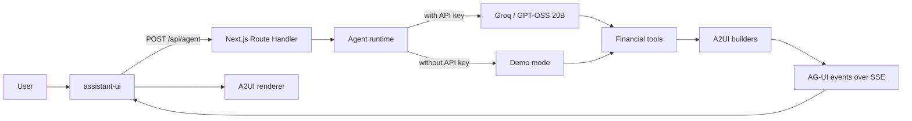

# United Personal Finance

A conversation-first personal finance assistant for recording transactions in Portuguese, reviewing credit card statements, and analyzing financial trends with deterministic results.

[](https://github.com/jonathabot/united-personal-finance/actions/workflows/ci.yml)

The project combines a language agent with a generative interface. AI interprets each request and selects tools; amounts, installments, totals, and projections are calculated by testable TypeScript code.

## Screenshots

### Desktop


### Mobile

| Login screen | Text conversation | Financial projection |
| :---: | :---: | :---: |
|  |  |  |

## Technology stack

| Technology | Usage |
| --- | --- |
| Next.js 16 | Full-stack web application and agent route. |
| React 19 | Interface, chat, and component catalog. |
| assistant-ui | Runtime, conversation primitives, composer, and visual message lifecycle. |
| `@assistant-ui/react-ag-ui` | Official adapter between assistant-ui and the AG-UI backend. |
| `@ag-ui/client` | `HttpAgent` client for consuming the SSE stream. |
| TypeScript | Financial domain and typed contracts. |
| Zod | Request and A2UI payload validation. |
| `@ag-ui/core` | AG-UI protocol types and events. |
| Groq SDK | Access to the model hosted by Groq. |
| GPT-OSS 20B | Language interpretation and tool selection. |
| Lucide React | Icons for the Pencil-based interface. |
| Recharts | Responsive financial charts rendered in the browser. |
| Supabase JS + SSR | Cookie-based authentication and RLS-aware Postgres access. |
| Vitest | Unit tests for the domain. |
| Playwright | E2E tests and desktop/mobile screenshot generation. |
| ESLint | Static code analysis. |

### Planned

- Vercel for application deployment.
- PWA support for mobile installation.

## Current status

The **local POC 1.0 is complete**. The conversational flow, financial engine,
tools, Supabase persistence, and visual catalog are integrated and validated by
the automated GitHub Actions suite. Publishing, PWA installation, and
observability are reserved for the post-POC phase.

## Current architecture



### Responsibilities

| Layer | Responsibility |
| --- | --- |
| Agent | Interpret language, identify intent, and select tools. |
| Tools | Expose authorized and validated financial operations. |
| Financial engine | Calculate cents, installments, statements, balances, and projections. |
| AG-UI | Transport the execution lifecycle, text, and visual events. |
| A2UI | Describe tables, cards, and charts as validated data. |
| React renderer | Validate payloads and render only allowed components. |
| Database | Store temporal financial data, conversations, and an auditable history protected by RLS. |

## Project principles

1. AI interprets; code calculates.
2. Money is stored as integer cents.
3. Model responses are validated before use.
4. The agent does not generate arbitrary HTML, JSX, or CSS.
5. Transactions must not be persisted without validation and confirmation.
6. Ambiguous operations must request clarification.
7. Edits and deletions must be auditable and reversible.

## Main project structure

```text
src/
├─ app/
│  ├─ api/agent/route.ts       # Agent event stream
│  ├─ auth/callback/route.ts   # Exchanges the authentication code for a session
│  ├─ login/                   # Authentication screen and actions
│  ├─ globals.css              # Responsive Pencil-based layout
│  └─ page.tsx                 # Application shell
├─ components/
│  ├─ a2ui/
│  │  ├─ catalog.ts            # Closed catalog of allowed components
│  │  ├─ renderer.tsx          # Declarative renderer
│  │  ├─ financial-health-card.tsx
│  │  ├─ projection-chart.tsx
│  │  ├─ category-breakdown.tsx
│  │  ├─ savings-opportunity-table.tsx
│  │  ├─ scenario-comparison.tsx
│  │  └─ feedback-card.tsx     # Clarification and error states
│  └─ chat/finance-chat.tsx    # Thread, composer, and assistant-ui runtime
└─ lib/
   ├─ a2ui/
   │  ├─ builders.ts           # Trusted financial payloads
   │  └─ schema.ts             # Zod contracts
   ├─ agent/runtime.ts         # Groq, tools, and demo fallback
   ├─ data/
   │  └─ demo-financial-data.ts # Temporary source used to test the chat
   ├─ finance/
   │  ├─ statements.ts        # Statement closing dates, due dates, and totals
   │  ├─ installments.ts      # Schedule and future installments
   │  ├─ monthly-summary.ts   # Consolidated monthly view
   │  ├─ projections.ts       # Projected balance and financial health
   │  ├─ categories.ts        # Category comparisons and opportunities
   │  ├─ scenarios.ts         # Simulations without persistence
   │  └─ finance.test.ts      # Deterministic engine test cases
   ├─ tools/
   │  ├─ definitions.ts       # Contracts exposed to the model
   │  ├─ schemas.ts           # Zod validation for arguments
   │  ├─ executor.ts          # Safe bridge to the financial engine
   │  └─ executor.test.ts     # Tool integration tests
   ├─ supabase/
   │  ├─ client.ts            # Browser client
   │  ├─ server.ts            # Cookie-based SSR client
   │  └─ config.ts            # Validated public configuration
   ├─ repositories/
   │  ├─ financial-repository.ts          # Data-source-independent contract
   │  ├─ demo-financial-repository.ts     # Fallback without Supabase
   │  └─ supabase-financial-repository.ts # RLS-protected live queries
   ├─ money.ts                 # Deterministic monetary operations
   └─ money.test.ts            # Monetary domain tests
```

## Running locally

Requirement: Node.js 22 or newer.

```bash
npm install
npm run dev
```

Open `http://localhost:3000`.

### Enabling the Groq agent

Create a key in GroqCloud and add a `.env.local` file at the project root. Do not commit this file.

```env
GROQ_API_KEY=gsk_your_key
GROQ_MODEL=openai/gpt-oss-20b
```

Restart the server after changing environment variables.

Without `GROQ_API_KEY`, the application uses local demo mode.

## Current examples

```text
Gastei 35 reais no Nubank com almoço
```

Produces an A2UI expense preview. In an authenticated session, the transaction
is persisted only after confirmation; in demo mode, it remains available only
during local execution.

```text
Mostre minhas faturas
```

Produces an A2UI table using demo data.

```text
Vou ficar apertado no próximo mês?
Onde estou gastando mais?
No que posso economizar?
E se eu reduzir delivery pela metade?
```

These questions trigger deterministic tools for projections, comparisons, analysis, and simulations. In an authenticated session, data comes from Supabase; without configuration, the application uses the August 2026 demo snapshot.

## Verification

```bash
npm test
npm run test:evals
npm run test:e2e
npm run screenshots
npm run lint
npm run build
```

POC 1.0 validation status:

- 95 tests passing across 11 files.
- 25 deterministic Agent Evals in Portuguese, with no Groq API usage.
- 5 E2E scenarios passing across Playwright desktop and mobile projects.
- 12 Supabase pgTAP tests executed only in GitHub Actions.
- Reproducible screenshots generated in `docs/screenshots/`.
- Lint passing.
- TypeScript passing during the build.
- Production build passing.
- Local application responding at `http://localhost:3000`.

### POC 1.0 completion criteria

- Query, analysis, simulation, and transaction flows covered by the suite.
- Deterministic financial calculations performed with integer cents.
- Persistent changes protected by preview and confirmation.
- Auditable corrections, cancellations, and undo operations.
- Authenticated data isolated by user through RLS.
- Dashboard, tables, and history displayed as cards within the conversation.
- Responsive interface available for local desktop and mobile validation.

### Agent Evals

The suite in `src/lib/agent/evals/` stores versioned Brazilian Portuguese
phrases and verifies both the selected intent and the arguments sent to tools.
It covers formal language, slang, amounts, installments, context, cancellation,
undo operations, and messages that must not trigger financial operations.

```bash
npm run test:evals
```

These evals are deterministic and do not call Groq. Evals against the live model
should be added separately and run manually or on a schedule, without blocking
every local run or pull request.

## Roadmap POC 1.0

| Order | Stage | Main deliverables | Completion criteria | Status |
| ---: | --- | --- | --- | --- |
| 1 | Conversational runtime | Send complete history; maintain `threadId`; preserve context between messages; allow a direct answer, tool call, or clarification request; prevent tools from running for irrelevant messages; visually distinguish Groq and demo mode. | Follow-up questions and contextual corrections work without the agent inventing operations. | ✅ Complete — foundation |
| 2 | Financial engine | Consolidated view; statements by closing and due date; future installments; category grouping; monthly comparison; balance projection; savings opportunities; simulations without persistence. | Every total is reproducible, calculated in cents, and covered by tests. | ✅ Complete — foundation |
| 3 | Agent tools | Implement `queryFinancialOverview`, `createTransactionDraft`, `confirmTransaction`, `analyzeSpending`, and `simulateFinancialScenario`. | The agent can query, analyze, simulate, and propose transactions without calculating amounts itself. | ✅ Complete — foundation |
| 4 | A2UI catalog | Create `FinancialHealthCard`, `ProjectionChart`, `CategoryBreakdown`, `SavingsOpportunityTable`, `ScenarioComparison`, and clarification, loading, and error components. | Financial queries automatically choose an appropriate validated presentation. | ✅ Complete — foundation |
| 5 | Supabase | Migrations, authentication, RLS, temporal entities, recurring values, audit trail, confirmable drafts, and conversation context. | Each user can access only their data; structural changes are temporal, confirmable, and auditable; conversations persist across devices. | ✅ Complete |
| 6 | Complete transaction flow | Message → interpretation → validated draft → confirmation → persistence → recalculation → A2UI response. Include editing, cancellation, and duplicate-confirmation protection. | A confirmed expense appears correctly on its statement and in history. | ✅ Complete and validated |
| 7 | Analytical conversations | Answer projections, comparisons, potential savings, and scenarios such as “will money be tight next month?” and “what if I cut restaurant spending in half?”. | Answers use real data, show assumptions, and never depend on model arithmetic. | ✅ Complete and covered by the POC 1.0 suite |
| 8 | Release organization | Review changes, document known limitations, validate the final commit in CI, and publish the version tag. | The repository is clean, the final workflow is green, and `v1.0.0` points to the approved commit. | ✅ Complete and tagged as `v1.0.0` |

## Roadmap POC 1.2

| Order | Stage | Main deliverables | Completion criteria | Status |
| ---: | --- | --- | --- | --- |
| 1 | Expanded Agent Evals | Cover ambiguities between cards and accounts, contextual corrections, colloquial amounts, regional variations, typos, and negative tool-triggering cases. | At least 25 deterministic Portuguese scenarios validate intent and arguments without calling Groq. | ✅ Complete — 25 evals |
| 2 | Playwright E2E | Cover demo loading, composer behavior, financial responses, responsive layout, and reproducible desktop and mobile screenshots. | Core flows pass in desktop and mobile projects without horizontal overflow. | ✅ Complete — 5 scenarios |
| 3 | GitHub Actions | Run lint, unit tests, Agent Evals, build, and Playwright on pushes and pull requests to `main`; preserve E2E failure artifacts. | Every version candidate is validated remotely without relying on the development machine. | ✅ Complete |
| 4 | Isolated Supabase tests | Validate migrations, cross-user RLS, idempotent confirmation, persisted expiration, and auditing in an ephemeral database. | The 12 pgTAP tests pass only in GitHub Actions and require no local container. | ✅ Complete — 12 pgTAP tests |
| 5 | LLM-first runtime and conversational evaluation | Build a 30–50-scenario conversational baseline, reduce rigid keyword routing, preserve safety fallbacks, and let the model choose between a direct response, clarification, or tool. | Varied and contextual requests select the correct behavior without depending on exact phrases. | Planned |
| 6 | Structured preferences and memory | Add confirmable per-user financial preferences and separate recent messages from structured memory, referenced entities, and pending decisions. | Short follow-ups and supported preference changes remain contextual, auditable, and deterministic. | Planned |
| 7 | OSS vs. Gemini evaluation | Run the same evaluation suite against both providers and compare tool selection, arguments, context, hallucinations, latency, limits, cost, and data handling. | Provider selection is supported by reproducible evidence. | Planned |
| 8 | Deployment, PWA, and observability | Publish to Vercel, configure Groq and Supabase securely, add installability, usage limits, outage handling, monitoring, and scheduled live-model evals. | The application operates securely and predictably outside the local environment. | Future — outside the current local scope |

## Functional documentation

- [MVP scope](specs/mvp.md)
- [Financial rules](specs/finance-rules.md)
- [Data model](specs/data-model.md)
- [Acceptance criteria](specs/acceptance-criteria.md)
- Prototypes and Pencil source files in [`design/`](design/)

## Security

The MVP does not integrate with banks and must not store passwords or credentials from financial institutions. API keys remain exclusively on the server. Data returned by models must never be persisted without domain validation.

## Implemented

- Responsive desktop and mobile conversation interface based on the Pencil prototypes.
- Chat built with assistant-ui primitives, its runtime, and the official `react-ag-ui` adapter.
- Stable `threadId` and multi-turn history limited to the 40 most recent messages.
- Direct responses, tool calls, and clarification requests in the same runtime.
- Intent barrier preventing tools incompatible with the current message from running.
- Visual distinction between Groq and demo mode, with backend-controlled capability descriptions.
- Next.js `POST /api/agent` route and AG-UI execution events over SSE.
- Declarative A2UI-inspired catalog with validated payloads, tables, charts, feedback, and expense confirmation cards.
- Groq provider using `openai/gpt-oss-20b`, plus a deterministic local demo fallback.
- Integer-cent monetary operations, floating-point-free text parsing, and dates calculated in `America/Sao_Paulo`.
- Deterministic financial engine for statements, installments, summaries, projections, categories, and scenarios.
- Correct handling of personal, third-party, and refunded expenses.
- Validated tools for summaries, comparisons, drafts, confirmations, analysis, and simulations.
- Supabase SSR clients, cookie sessions, login, registration, email confirmation, logout, and protected agent routes.
- Temporal financial model with per-user RLS, auditing, recurring values, and controlled onboarding.
- Persistent, confirmable drafts for entity and transaction changes, with idempotency, cancellation, expiration, and concurrency locks.
- Auditable renaming, value changes, settlement, corrections, installment acceleration, and undo operations.
- Conversation history restored across sessions and devices.
- Real-data projections, monthly comparisons, savings opportunities, and scenarios with visible assumptions.
- Unit tests for money and the financial engine, plus deterministic Agent Evals for Portuguese and colloquial input.

## Demo or incomplete

- Demo data remains only as a fallback when Supabase is not configured.
- Demo mode recognizes only a limited set of phrases through local rules.
- Groq is used only when `GROQ_API_KEY` is configured.
- Text conversation history is persisted; previous A2UI cards are reconstructed from new queries rather than serialized in history.
- Read tools query the authenticated user's cards, recurring values, monthly exceptions, transactions, and installments.
- Creation, renaming, value adjustments, entity settlement, one-time or installment transactions, corrections, early payments, and undo operations use persistent confirmation.
- The expense card's **Edit**, **Cancel**, and **Confirm** buttons are connected to the auditable chat flow.
- Migration `202608200008_complete_step6.sql` has been applied and validated in the remote project.
- The engine and query tools receive the authenticated user's persisted data.
- The current integration uses the core AG-UI/A2UI concepts and events but is not yet a complete implementation of every official specification.
