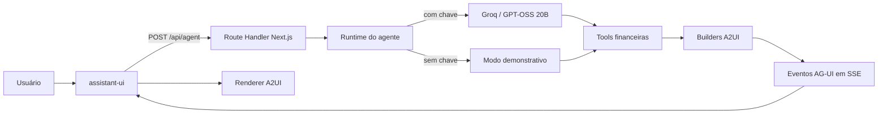

# United Personal Finance

Assistente pessoal de finanças, orientado por conversa, para registrar movimentações em português, consultar faturas e analisar a evolução financeira com resultados determinísticos.

O projeto combina um agente de linguagem com uma interface generativa. A IA interpreta o pedido e escolhe ferramentas; valores, parcelas, totais e projeções são calculados por código TypeScript testável.

## Estado atual

O projeto está em desenvolvimento e já possui um primeiro fluxo executável.

### Implementado

- Interface responsiva baseada nos protótipos do Pencil.
- Layout de conversa para desktop e celular.
- Chat construído com os primitives e o runtime do assistant-ui.
- Cliente `HttpAgent` conectado ao backend pelo adaptador oficial `react-ag-ui`.
- Histórico multi-turno enviado ao agente, limitado às 40 mensagens mais recentes.
- `threadId` estável durante a conversa aberta no navegador.
- Resposta direta, tool calling e pedidos de esclarecimento no mesmo runtime.
- Barreira de intenção que impede a execução de tools incompatíveis com a mensagem atual.
- Indicador visual para diferenciar Groq e modo demonstração.
- Resposta de capacidades controlada pelo backend para não anunciar funções inexistentes.
- Rota `POST /api/agent` no Next.js.
- Eventos de execução baseados no modelo do protocolo AG-UI.
- Catálogo financeiro declarativo inspirado no A2UI v0.9.1.
- Validação dos payloads de interface com Zod.
- Renderização dinâmica de tabelas financeiras.
- Card estruturado para confirmação de despesas.
- Provider para Groq usando o modelo `openai/gpt-oss-20b`.
- Modo demonstrativo quando `GROQ_API_KEY` não está configurada.
- Valores monetários representados como centavos inteiros.
- Conversão de texto monetário sem aritmética de ponto flutuante.
- Datas calculadas no fuso `America/Sao_Paulo`.
- Motor financeiro determinístico para faturas, vencimentos, parcelamento, resumo mensal, projeções, categorias e cenários.
- Separação entre despesas pessoais e de terceiros, mantendo ambas no total da fatura.
- Estornos tratados como redução da despesa e da fatura, sem virar receita.
- Classificação financeira reproduzível em `confortável`, `atenção` ou `crítica`.
- Cinco tools validadas para resumo financeiro, rascunho, confirmação, análise de gastos e simulação.
- Dados demonstrativos centralizados com receitas, cartões, categorias e histórico mensal.
- Modo Groq e modo demonstração conectados ao mesmo executor de tools e ao mesmo motor financeiro.
- Testes unitários para dinheiro, calendário de cartões, resumos, projeções e simulações.

### Demonstrativo ou incompleto

- As faturas exibidas ainda são dados fixos de demonstração.
- O modo demo reconhece somente algumas frases por regras locais.
- A Groq é utilizada apenas quando `GROQ_API_KEY` está configurada.
- O histórico é mantido no navegador, mas ainda não é persistido entre sessões ou dispositivos.
- As tools operam sobre uma fotografia demonstrativa de agosto de 2026; ainda não consultam dados pessoais reais.
- Os botões **Editar** e **Confirmar** ainda não persistem alterações.
- Banco de dados, autenticação e auditoria ainda não foram conectados.
- O motor de projeções, análises e simulações já existe, mas ainda não está conectado às tools nem a dados persistidos.
- A integração atual usa os conceitos e eventos centrais de AG-UI/A2UI, mas ainda não representa uma implementação integral de todas as especificações oficiais.

## Arquitetura atual



### Responsabilidades

| Camada | Responsabilidade |
| --- | --- |
| Agente | Interpretar linguagem, identificar intenção e selecionar tools. |
| Tools | Expor operações financeiras autorizadas e validadas. |
| Motor financeiro | Calcular centavos, parcelas, faturas, saldos e projeções. |
| AG-UI | Transportar ciclo de execução, texto e eventos visuais. |
| A2UI | Descrever tabelas, cards e futuras visualizações como dados. |
| Renderer React | Validar o payload e renderizar somente componentes permitidos. |
| Banco de dados | Futuramente armazenar dados financeiros e histórico auditável. |

## Princípios do projeto

1. A IA interpreta; o código calcula.
2. Dinheiro é armazenado em centavos inteiros.
3. Respostas do modelo passam por validação antes de serem utilizadas.
4. O agente não gera HTML, JSX ou CSS arbitrário.
5. Uma transação não deve ser persistida sem validação e confirmação.
6. Operações ambíguas devem pedir esclarecimento.
7. Edições e exclusões deverão ser auditáveis e reversíveis.

## Tecnologias

| Tecnologia | Uso |
| --- | --- |
| Next.js 16 | Aplicação web full-stack e rota do agente. |
| React 19 | Interface, chat e catálogo de componentes. |
| assistant-ui | Runtime, primitives de conversa, composer e ciclo visual das mensagens. |
| `@assistant-ui/react-ag-ui` | Adaptador oficial entre assistant-ui e o backend AG-UI. |
| `@ag-ui/client` | Cliente `HttpAgent` para consumir o stream SSE. |
| TypeScript | Domínio financeiro e contratos tipados. |
| Zod | Validação de requests e payloads A2UI. |
| `@ag-ui/core` | Tipos e eventos do protocolo AG-UI. |
| Groq SDK | Acesso ao modelo hospedado na Groq. |
| GPT-OSS 20B | Interpretação de linguagem e seleção de tools. |
| Lucide React | Ícones da interface baseada no Pencil. |
| Vitest | Testes unitários do domínio. |
| ESLint | Análise estática do código. |

### Planejado

- Supabase Postgres para persistência.
- Supabase Auth para autenticação.
- Row Level Security para isolamento dos dados.
- Vercel para deploy da aplicação.
- PWA para instalação no celular.

## Estrutura principal

```text
src/
├─ app/
│  ├─ api/agent/route.ts       # Stream de eventos do agente
│  ├─ globals.css              # Layout responsivo baseado no Pencil
│  └─ page.tsx                 # Shell da aplicação
├─ components/
│  ├─ a2ui/renderer.tsx        # Registry e renderer declarativo
│  └─ chat/finance-chat.tsx    # Thread, composer e runtime assistant-ui
└─ lib/
   ├─ a2ui/
   │  ├─ builders.ts           # Payloads financeiros confiáveis
   │  └─ schema.ts             # Contratos Zod
   ├─ agent/runtime.ts         # Groq, tools e fallback demonstrativo
   ├─ data/
   │  └─ demo-financial-data.ts # Fonte temporária usada para testar o chat
   ├─ finance/
   │  ├─ statements.ts        # Fechamento, vencimento e total das faturas
   │  ├─ installments.ts      # Cronograma e parcelas futuras
   │  ├─ monthly-summary.ts   # Visão consolidada do mês
   │  ├─ projections.ts       # Saldo projetado e saúde financeira
   │  ├─ categories.ts        # Comparação e oportunidades por categoria
   │  ├─ scenarios.ts         # Simulações sem persistência
   │  └─ finance.test.ts      # Casos determinísticos do motor
   ├─ tools/
   │  ├─ definitions.ts       # Contratos apresentados ao modelo
   │  ├─ schemas.ts           # Validação Zod dos argumentos
   │  ├─ executor.ts          # Ponte segura para o motor financeiro
   │  └─ executor.test.ts     # Testes de integração das tools
   ├─ money.ts                 # Operações monetárias determinísticas
   └─ money.test.ts            # Testes do domínio monetário
```

## Executar localmente

Requisito: Node.js 22 ou mais recente.

```bash
npm install
npm run dev
```

Acesse `http://localhost:3000`.

### Ativar o agente da Groq

Crie uma chave no GroqCloud e adicione um arquivo `.env.local` na raiz. Não envie esse arquivo ao repositório.

```env
GROQ_API_KEY=gsk_sua_chave
GROQ_MODEL=openai/gpt-oss-20b
```

Reinicie o servidor depois de alterar as variáveis.

Sem `GROQ_API_KEY`, a aplicação utiliza o modo demonstrativo local.

## Exemplos atuais

```text
Gastei 35 reais no Nubank com almoço
```

Produz uma prévia A2UI da despesa. Nada é persistido.

```text
Mostre minhas faturas
```

Produz uma tabela A2UI com dados demonstrativos.

```text
Vou ficar apertado no próximo mês?
Onde estou gastando mais?
No que posso economizar?
E se eu reduzir delivery pela metade?
```

Essas perguntas acionam as tools de projeção, análise e simulação sobre a fotografia demonstrativa de agosto de 2026.

## Verificações

```bash
npm test
npm run lint
npm run build
```

Estado da última validação:

- 28 testes aprovados.
- Lint aprovado.
- TypeScript aprovado durante o build.
- Build de produção aprovado.

## Próximos passos

| Ordem | Etapa | Principais entregas | Concluído quando | Status |
| ---: | --- | --- | --- | --- |
| 1 | Runtime conversacional | Enviar o histórico completo; manter `threadId`; preservar contexto entre mensagens; permitir resposta direta, tool ou pedido de esclarecimento; impedir tools em mensagens irrelevantes; identificar visualmente Groq e modo demo. | Perguntas de continuidade e correções contextuais funcionarem sem o agente inventar operações. | ✅ Concluído — base |
| 2 | Motor financeiro | Visão consolidada; faturas por fechamento e vencimento; parcelas futuras; agrupamento por categoria; comparação mensal; projeção de saldo; oportunidades de economia; simulações sem persistência. | Todos os totais forem reproduzíveis, calculados em centavos e cobertos por testes. | ✅ Concluído — base |
| 3 | Tools do agente | Implementar `queryFinancialOverview`, `createTransactionDraft`, `confirmTransaction`, `analyzeSpending` e `simulateFinancialScenario`. | O agente conseguir consultar, analisar, simular e propor lançamentos sem calcular valores por conta própria. | ✅ Concluído — base |
| 4 | Catálogo A2UI | Criar `FinancialHealthCard`, `ProjectionChart`, `CategoryBreakdown`, `SavingsOpportunityTable`, `ScenarioComparison` e componentes de esclarecimento, loading e erro. | Consultas financeiras escolherem automaticamente uma apresentação adequada e validada. | ➡️ Próximo |
| 5 | Supabase | Criar migrations; configurar autenticação; aplicar Row Level Security; persistir contas, cartões, categorias, transações, auditoria e contexto das conversas. | Cada usuário acessar somente seus dados e todas as alterações financeiras serem auditáveis. | ⏳ Pendente |
| 6 | Fluxo completo de lançamento | Mensagem → interpretação → rascunho validado → confirmação → persistência → recálculo → resposta A2UI. Incluir edição, cancelamento e proteção contra confirmação duplicada. | Uma despesa confirmada aparecer corretamente na fatura e no histórico. | ⏳ Pendente |
| 7 | Conversas analíticas | Responder projeções, comparações, possíveis economias e cenários como “vou ficar apertado no próximo mês?” e “e se eu reduzir restaurantes pela metade?”. | As respostas utilizarem dados reais, exibirem premissas e nunca dependerem de aritmética do modelo. | ⏳ Pendente |
| 8 | Deploy e PWA | Publicar na Vercel; conectar Groq e Supabase por variáveis de ambiente; instalar como PWA; validar desktop e celular; adicionar observabilidade, limites e tratamento de indisponibilidade. | O aplicativo funcionar com segurança fora do ambiente local e puder ser instalado no celular. | ⏳ Pendente |

## Documentação funcional

- [Escopo do MVP](specs/mvp.md)
- [Regras financeiras](specs/finance-rules.md)
- [Modelo de dados](specs/data-model.md)
- [Critérios de aceite](specs/acceptance-criteria.md)
- Protótipos e arquivo Pencil em [`design/`](design/)

## Segurança

O MVP não realiza integração bancária e não deve armazenar senhas ou credenciais de instituições financeiras. Chaves de API permanecem exclusivamente no servidor. Dados retornados por modelos nunca devem ser persistidos sem validação do domínio.
